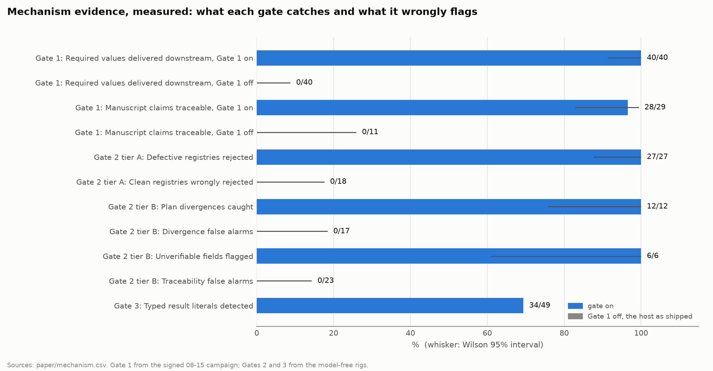

# G.A.T.E.S.

A portable validity layer for autonomous research agents.

Autonomous research scaffolds like Agent Laboratory and AI-Scientist-v2 publish numbers their experiments never produced.
The usual explanation is that the model fabricates.
In the scaffold we audited, the cause was plainer than that.
The host cut experiment output to 1,000 characters before any agent read it, and it appended the crash marker after the program's own output, so the same cut dropped the marker too.
The writing agent never saw the real numbers, and the failure detector never saw the crash.
A run that raised `NameError` on every attempt scored `1.0` from the reward model and went into the paper with a full results table to two decimals.

G.A.T.E.S. treats that as an information-flow defect, not a model tendency, and closes the channel at three points.

| Gate | Question it answers | Status |
|---|---|---|
| 1, execution validity | Did this code run, and did this run produce the reported numbers? | complete, measured on a live scaffold |
| 2, source-result coherence | Are the results inside their bounds, consistent with each other, and produced the way the plan said? | built, loop closed, evaluated offline |
| 3, report validity | Does every number and citation in the manuscript trace to something that exists? | built, loop closed, evaluated offline |

"Measured" means a controlled campaign against a live scaffold produced numbers we can show.
Gate 1 has had one.
Gates 2 and 3 have labelled offline evaluations and passing tests, which is a weaker claim, and this README keeps the two apart.
The benchmark evaluation that would measure all three is planned in [`paper/PLAN.md`](paper/PLAN.md) and has not run.

Full design: [`docs/PLAN.md`](docs/PLAN.md).

## Results so far



Every bar comes from [`paper/mechanism.csv`](paper/mechanism.csv), and every row there names the rig or signed report that produced it.
`tests/test_mechanism.py` reruns the Gate 2 and Gate 3 rigs and fails if a row stops matching.
The Gate 1 rows come from the signed 08-15 campaign, which nothing reruns.

### Gate 1 on a live scaffold

One controlled A/B campaign.
`deepseek-v4-flash` drove both arms from one config whose SHA-256 matches on each side (`a0409cf…3de0e`), so the arms differ only in whether Gate 1 is in the loop.
The method and the evidence index are in [`reports/finalized-report-and-results/`](reports/finalized-report-and-results/).

The headline compares the same executions on both sides and asks how much of each reached the next phase.

| Measure | Gate 1 on | Gate 1 off |
|---|---:|---:|
| Required key/value pairs delivered downstream | 40/40 | 0/40 |
| Attempts delivering all four required values | 10/10 | 0/10 |
| Citable registry values in the final run | 4 | 0 |
| Required values reported as numbers in the paper | 4/4 | 0/4 |

The 1,000-character channel delivered none of the 40 required pairs the runs had recorded.
The measurements existed, and nothing downstream could read them.

| Traceability of the generated paper | Gate 1 on | Gate 1 off |
|---|---:|---:|
| Claims taken straight from the registry | 19/29 (65.5%) | 0/11 (0%) |
| Claims from the registry or checkably derived from it | 28/29 (96.6%) | 0/11 (0%) |

The host's crash detector is a substring search over a fixed slice, so the rig rebuilds it exactly.
For the archived crash, the `[CODE EXECUTION ERROR]` marker lands at character 3,442.
A 1,000-character channel cannot see it and a 4,000-character one can.
Across the rig's scenarios, Gate 1 rejected 6 engineer turns, and the host's detector would have accepted 3 of them.

`results.values_traced` ran over all 20 experiment sources the campaign produced, 203 `record_result` call sites.
It classified every one as computed, so it raised no false warning on real agent code.
The check leans toward missing a case, because a false warning costs the engineer a rewrite for nothing.

The log scanner, against the 68 labelled lines in `tests/fixtures/log_corpus.jsonl` (34 signals), with Wilson 95% intervals:

| Scanner | Precision | Recall |
|---|---|---|
| deterministic patterns | 1.000 (0.824-1.000) | 0.529 (0.367-0.685) |
| patterns plus `qwen3:8b`, 3-shot | 1.000 (0.887-1.000) | 0.882 (0.734-0.953) |

The corpus holds precision at 1.0, and the model layer exists to raise recall.
A model finding is a WARN and cannot reach the verdict.

### Gates 2 and 3 offline

Gate 2 tier A rejected all 27 defective registries on the right key and none of the 18 clean ones (`python -m rig.gate2_tier_a_eval`).
Tier B caught 12 of 12 plan divergences with 0 false alarms in 17, and flagged 6 of 6 unverifiable fields with 0 false alarms in 23 (`python -m rig.gate2_tier_b_eval`).

Gate 3's `report.no_numeric_literals_in_results` scans prose, so it misses some numbers.
`python -m rig.gate3_scanner_miss` scores it on 49 hand-labelled claims in our two archived manuscripts.
It detects 34, misses 15, and reports 6 numbers that are not claims.
Twelve of the 15 misses have one cause: a findings line carrying a `\ref`, which `SKIP_LINE` drops whole.
We left the scanner as it is, because the published Gate 1 traceability number came from it, and changing it would restate a measured result.

So "no fabricated number survives" is a property of the pipeline, not of the scanner.
The writer emits `\result{key}` tokens, and the renderer substitutes recorded values.
The scanner only checks that the writer used the pipeline, and [`docs/PLAN.md`](docs/PLAN.md) §5.2 states that with the number beside it.

### What did not improve

Mean of three final reviewer scores: 3.735 gated, 3.765 ungated.
The two are level, and reviewers recommended rejecting both papers.
Gate 1 fixed where the numbers came from.
It did not make the science better, and no number here says it did.

## Planned evaluation

These seven figures are the paper's evaluation, and every one is a placeholder.
`paper/figures.py` stamps PLACEHOLDER on any figure that still draws a dummy row, and `paper/collect.py` turns rows to measured as runs finish.
The significance test is fixed in advance in [`paper/PLAN.md`](paper/PLAN.md) §9: an exact McNemar test per benchmark on level 0 against level 3, Holm across the three, and a non-inferiority bound on each task score.

| Figure | What it will show |
|---|---|
|  | CORE-Bench at the four `GATES_LEVEL`s |
|  | MLR-Bench at the four levels |
|  | BadScientist at the four levels, Gate 3's adversarial test |
|  | each system alone and with GATES, CORE-Bench |
|  | each system alone and with GATES, MLR-Bench |
|  | each system alone and with GATES, BadScientist |
|  | released papers citing an arXiv id that does not exist |

## Install

```bash
pip install -e /path/to/gates
```

The runtime is the Python standard library and nothing else, so it drops into whatever environment the host scaffold already has.

## Use

```python
from gates import Gate1Config, run_gate1, render_feedback

report = run_gate1(experiment_source, Gate1Config(
    expected_keys=("exp1.K2.test_acc", "exp2.speedup"),
    timeout_s=900,
))

if not report.passed:
    send_back_to_the_engineer(render_feedback(report))
else:
    verified = {k: m.value for k, m in report.metrics().items()}
```

Gate 1 injects the results API into the experiment's namespace, so the agent has no import to get wrong:

```python
record_result("exp1.K2.test_acc", test_acc, unit="ratio")
```

Pass the variable.
Gate 1 re-parses the source, finds the call site, and fails a value typed in as a literal.
Assigning the literal to a name first does not hide it.
The same pass follows each name back through its bindings and reports a value whose every input is a constant.

## What Gate 1 checks

Before anything runs, so a broken program costs no compute:

- `static.syntax_valid`: the source compiles.
- `static.no_unbound_names`: no name is read but never bound. It uses `symtable`, the interpreter's own scope rules, so closures, comprehensions, `global`, walrus and class scopes all resolve correctly.
- `static.no_banned_calls`: no `exit()` or `sys.exit()` forging a clean exit code.

At run time, in a fresh process with an empty namespace:

- `exec.exit_code_zero`, `exec.no_uncaught_exception`, `exec.completed_within_budget`.
- `env.clean_namespace`: nothing carried over from a previous attempt.
- `env.code_identity`: the source the child ran hashes to the source submitted. That hash is what makes "this value came from this code" checkable.
- `exec.no_swallowed_traceback` warns when the experiment caught an error and carried on. It scans both streams, because `except Exception as e: print(e)` puts the evidence on stdout.
- `logs.no_error_signals` warns on trouble the run reported and continued past: numerical warnings that corrupt a metric (`invalid value encountered`, `divide by zero`), CUDA failures and CPU fallbacks, non-convergence, and `ERROR`-level logging. It favours precision, since a false positive costs the agent a rewrite for nothing. It flags `ValueError:` and ignores `Mean Squared Error:`.
- `env.seed_recorded` warns when a run declares no seed, because nobody can re-run it to check its numbers.

The results contract:

- `results.contract_present`, `results.expected_keys_present`.
- `results.values_computed`: no metric value is a literal in the source.
- `results.values_traced` warns when a value resolves to source literals once its variables are followed back to their bindings. `results.values_computed` reads only the call site, so `record_result("k", 0.816)` fails it and `acc = 0.816` then `record_result("k", acc)` passes it. This check follows the names. It warns instead of failing because a constant recorded on purpose, like a configured batch size, looks the same as a fabricated one until you know what the number means, and that is Gate 2's question.
- `results.values_finite`.
- `results.declared_keys_only` warns on keys the plan never declared. `results.expected_keys_present` tests presence, not equality, so an experiment can meet its contract and record anything else too. When a scaffold prepends an earlier phase's code, the earlier keys arrive here and can satisfy a contract this run never met.
- `results.single_observation` warns on a key recorded many times with changing values. Gate 1 keeps every call, so a metric written once per epoch arrives with its whole trajectory, and the report has to say whether it means the final value or the best one.
- `results.non_degenerate` warns on exact zeros, perfect scores and chance-level accuracy. AutoResearchClaw reports this limitation for value registries. The zeros are real measurements, so Gate 1 reports them and does not reject them.

A failure produces a short, specific report for the agent, and `gate1_report.json` for the record.
[`docs/GATE1_REQUIREMENTS.md`](docs/GATE1_REQUIREMENTS.md) ties each check to the test that holds it.

## The value registry

Gate 1 writes it, and a manuscript may cite nothing else.
Each value carries its type, its unit, a `trace_id` binding it to one execution, and its provenance chain, link by link:

```
task  ->  command  ->  log  ->  value  ->  claim
```

Gate 1 builds the first four links, in the order `CHAIN_LINKS` in `gates/registry.py` fixes.
Gate 3 adds the claim link for each `\result{key}` it renders, writes every full chain to `claims.json`, and reports the traced share as `report.claim_chains`.
Each link is marked resolved or not, and `chain_integrity` gives the rate across all values.
A number that matches something in a log is not the same as a number a recorded run produced.
Treating them as the same is what lets a fabricating agent pass a checker by keeping its numbers consistent.

A rejected run still gets a registry, marked `"citable": false`, so a consumer that forgets to check the verdict still cannot cite it.
That holds for a program rejected before it ran.
It has nothing to record, so its registry is empty, but the file exists and says it is not citable.

## What Gate 1 does not do

Gate 1 answers one question: did this code run, and did these numbers come from this run?
These are outside that question on purpose.

- `results.values_computed` checks the call site for a literal. It does not prove a measurement. `results.values_traced` follows variable bindings, but a constant that passes through a function call, a loop, or a container the pass cannot evaluate comes out as computed. Neither check proves a number was not fabricated.
- Whether a value means anything scientifically is Gate 2's question. Gate 1 passes a correctly measured number that means nothing.
- Whether the prose follows from the numbers is Gate 3's. In the campaign, the gated writer derived a scaling exponent from two points and called a single seeded dataset free of sampling variance. Gate 1 passed the run that produced them, correctly.
- Gate 1 does not check task compliance. The gated code imported a fixture despite a NumPy-only instruction, and it ran, so Gate 1 passed it.
- Static name analysis leaves module-level use-before-assignment to the runtime checks.
- Log scanning stops at 2,000,000 characters per stream. The full capture stays on disk.
- This is process isolation, not a security sandbox. The child runs as the same OS user. Gate 1 scrubs provider credentials from its environment and marks the parent non-dumpable on Linux, which closes `/proc/<ppid>/environ` and ptrace. Production use should run experiments in a container or a separate unprivileged account.
- The A/B sample is one workflow per arm. The ten candidates inside a workflow are dependent optimisation steps, not ten independent tasks. The channel result compares the same artifacts and needs no n. A claim about rates across tasks does need one, and this README makes none.
- The campaign ran no MLR-Bench task and measured no cost. The scaffold printed a `$0.0` placeholder instead of reading provider billing. The planned evaluation records cost per run in each manifest and totals it in `paper/costs.csv`.

## Porting to another scaffold

`gates/` imports nothing from any host.
The loops every host shares are in `gates/pipeline.py`.
Porting means writing one small adapter that builds their contexts, next to `gates/adapters/agentlab.py`, the reference adapter for Agent Laboratory.

The install path ships as agent skills: a router, `install-gates`, and one skill per gate.
In Claude Code:

```
/plugin marketplace add bananatruck/gates
/plugin install gates@gates
```

Any other agent can read `skills/install-gates/SKILL.md` and follow it from there.

### Choosing which gates run

`GATES_LEVEL` picks the arm.
The levels are cumulative, because each gate reads what the one before it produced.

| `GATES_LEVEL` | Gates open |
|---|---|
| `0` | none, the host as shipped |
| `1` | Gate 1 |
| `2` | Gates 1 and 2 |
| `3` | all three, the default |

A closed gate raises before it spends an agent turn, so no setting runs Gate 2 or Gate 3 without the gates below it.
`GATES_GATE1=off` still means level 0, and setting both raises.

## Artifacts

Every attempt writes to `<artifact_root>/gate1/attempt_NN/`:

```
experiment.py       exactly what ran
stdout.txt          complete, uncut
stderr.txt          complete, uncut
results.json        the declared metrics, with call-site provenance and every
                    observation of every key
registry.json       the citable value registry: typed values, trace ids,
                    provenance chains, chain-integrity rate
gate1_report.json   the verdict and every check
```

Each attempt also adds one line to `divergence.jsonl`, pairing the gate's verdict with what the reward model scored the same attempt through the 1,000-character view the host had.
That file is the evidence table.

## Tests

```bash
pip install -e ".[dev]" && pytest && ruff check .
```

| Suite | Tests |
|---|---:|
| Gate 1: checks, loop, level-0 bypass | 141 |
| Gate 2: checks, loop, tier comparison | 136 |
| Gate 3: checks, loop, model layer, scanner miss, arXiv resolver | 155 |
| Model layer and log scanning | 148 |
| Wiring, levels, setup, install skills, key handling | 92 |
| Evaluation tooling and this status check | 61 |
| **Total** | **733** |

One test, the live arXiv lookup, is skipped unless `GATES_LIVE_ARXIV=1`.
The suite runs with every socket refused, so no test can quietly depend on the network (D61 in `progress.md`).
`tests/test_progress.py` recounts this table on every run and fails if a row is stale.

CI runs the suite on Python 3.10 through 3.14 and runs `ruff` with the rules in `pyproject.toml`.
A separate job installs the package with no test dependencies and imports every module on a bare interpreter.
The stdlib-only rule is a promise to every scaffold the layer drops into, so CI checks it.

The host scaffold's integration suite lives in the host repository.

## Seeing the loop run

The tests check one thing at a time.
`rig/` runs the whole loop end to end, with a scripted engineer in place of the model.
Every code path is the shipped one and only the code's author is fake, so it costs nothing to run on every change.

```bash
python -m rig.gate1_loop              # every scenario, full transcript
python -m rig.gate1_loop archived-run # replay the audited run: 3 turns, no paper
python -m rig.gate1_loop --quiet      # summary table only
```

Five scenarios cover the failures Gate 1 claims to catch.
They are the audited run replayed, a rejection the agent answers by inventing numbers, three executions inside one engineer turn, a run that passes with four warnings, and a namespace leak.
Each declares the checks it must fail, the turns it must use and its final state, so a scenario cannot drift from its own description.
The exit status is non-zero on any mismatch.

The rig also rebuilds the host's failure detector and reports which attempts Gate 1 rejected that the host would have accepted.
It does not rebuild `get_score`, an LLM at temperature 0.6, so the ledger's reward column stays `null` unless `run_loop` gets a real model.

Gate 2's loop has its own rig.
Every submission there is code, and it runs under Gate 1 first, so a fix typed into a `record_result` call fails before Gate 2 sees it.
A spent Gate 2 budget proceeds with the discrepancy declared.

```bash
python -m rig.gate2_loop              # six scenarios, full transcript
python -m rig.gate3_loop              # ten scenarios; a spent budget raises
python -m rig.gate2_tier_comparison   # what tiers A, B and C each add
```

The tier comparison is written up in [`docs/research/gate2-tier-comparison.md`](docs/research/gate2-tier-comparison.md).

Three rig tools need a real model or arXiv, and the suite runs each one against a fake:

```bash
python -m rig.tuning --backend deepseek-flash --key-file keys.env   # does model feedback converge faster than the template?
python -m rig.corpus --backend deepseek-flash --key-file keys.env   # which log-scanner prompt scores best?
python -m rig.posthoc_audit papers/                                 # released papers citing ids that do not exist
```

## Project status

This is a research project in progress, and the tables above are a progress report.
Gate 1 is done and measured on a live scaffold.
Gates 2 and 3 are built, tested, and evaluated offline, and have not run in a campaign.
The benchmark evaluation is planned in [`paper/PLAN.md`](paper/PLAN.md), and [`progress.md`](progress.md) records where it stands.

The result in [What did not improve](#what-did-not-improve) is part of the finding.
The gate changed what reached the writing agent and did not change how reviewers scored the paper.
Closing the information-flow defect fixes where the numbers come from, not the quality of the research built on them.

Nothing in this README claims more than the artifacts under `reports/` and `paper/` support.

## License

MIT.
