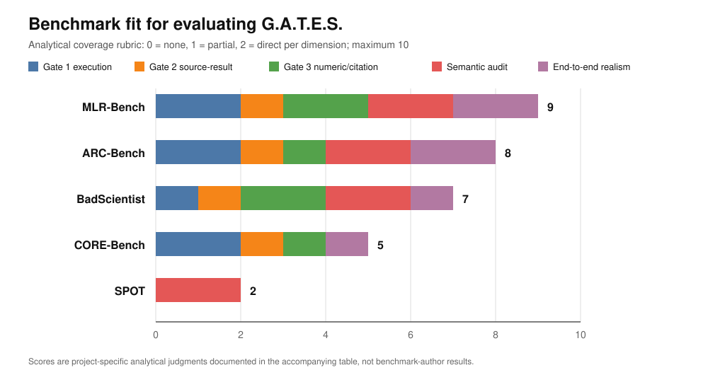

# Gate 2 / Gate 3 literature readout

Status: draft for the Thursday readout. Not merged.
Scope: what the cited literature actually says, and the six design questions it bears on.

Every number below was read off a PDF in the `Sources/` folder or off the arXiv source, and
the page or table it came from is named. Where I could not verify a number, it says so.
Nothing here is a measurement of our own system.

The two frozen constraints held: `reports/finalized-report-and-results/` was not touched,
and nothing here treats `gates/retrieval.py` as a paper registry (it is BM25 over the
log-line exemplar bank in `gates/exemplars.py`).

---

## 0. Correction: the 42% is real, and I had it wrong first time round

My first pass through this searched **AutoResearchClaw** (`2605.20025`) for the 42% in the
brief, did not find it, and reported the brief as mistaken. That was my error. The number
is real. It is in **ScientistOne** (`2605.26340`, Google Cloud AI Research), which is also
sitting in `Sources/Relative Results/` and which the brief did not name. The two arXiv ids
are adjacent, which is how I looked in the wrong one.

ScientistOne's contribution is a **CoE Integrity Audit**: four checks applied uniformly to
five systems, 15 papers each, 75 papers total. The checks are score verification,
specification violation, reference verification, and method-code alignment. Table 1:

| System | Score Verif. (up) | Spec. Violation (down) | Ref. Verif. (down) | Method-Code (up) |
|---|---|---|---|---|
| Sakana AI-Scientist v2 | 5/12 | 10/15 | 0/159 | 5/15 |
| **AutoResearchClaw** | **5/12 = 42%** | 0/15 | 3/196 | **3/15 = 20%** |
| DeepScientist | 11/12 | 0/15 | 42/201 | 5/15 |
| AI-Researcher | 9/12 | 1/15 | 21/222 | 12/15 |
| ScientistOne | 12/12 | 0/15 | 0/337 | 14/15 |

So "AutoResearchClaw has grounding, still 42% on audit" is exactly right, and the precise
form of it is sharper than the brief: AutoResearchClaw ships a verified numeric registry
and a four-layer citation pipeline, reports zero fabrication in its own ablation, and then
**scores 5/12 on score verification and 3/15 on method-code alignment when a third party
audits it.** Its own paper is not wrong about its registry; the registry simply does not
check the thing that fails.

That is the opening, and ScientistOne states the mechanism for us: the gap is largest on
"reference integrity and method-code alignment -- the two checks that test evidence
provenance rather than score reproduction." AutoResearchClaw's own §4 says the same thing
from the inside: *"verification is necessary but not sufficient... the gate cannot tell
whether those measurements answer the research question."* SAGE independently names it
**method-provenance grounding** and declares it open in itself and its baselines.

Three papers, three vocabularies, one gap: **score reproduction is solved and evidence
provenance is not.** Gate 2 tier B and Gate 3 citation binding are aimed at it, and both
are blocked on the same missing object (§4).

Note for the writeup: ScientistOne's method-code alignment check (I4) is model-judged
("I4 judgments were validated on a sampled basis", against I1-I3 which were manually
verified). So the 3/15 is not a deterministic measurement, and we should cite it as an
audited rate rather than a proven one -- the same honesty boundary we impose on our own
tier C.

## 1. Five SourceClaim entries, hand-pulled (the Friday unblock)

Chosen from all nine PDFs in `Sources/`, not just the ones the brief named. Two carry a
reported interval (and deliberately two *different kinds* of interval, which is §2); three
are point estimates with exact denominators, which is §3. All five construct and run
through the real `gates.gate2.band_for()`, and all five bind to a fetched `PaperRecord`
(§4). Output verified below, not asserted.

```python
CLAIMS = (
    # CORE-Bench Table A3. 95% CI over the mean, n=3 trials, test set.
    SourceClaim(
        key="reproduction_accuracy_hard",
        source_id="arXiv:2409.11363",
        value=21.48,
        interval=(18.88, 24.08),          # 21.48 +/- 2.60
        setting="CORE-Agent+GPT-4o, CORE-Bench-Hard test, n=3, 95% CI (Table A3)",
        describes="Agent reproduces a published result from the paper's own code+data capsule.",
    ),
    # PaperBench Table 4. ONE SEM, not a 95% CI. n=3 comes from the Table 9 caption,
    # which is the only place the seed count is stated.
    SourceClaim(
        key="replication_score",
        source_id="arXiv:2504.01848",
        value=21.0,
        interval=(20.2, 21.8),            # 21.0 +/- 0.8
        setting="Claude 3.5 Sonnet+BasicAgent, PaperBench, 3 seeds, +/-1 SEM (Table 4)",
        describes="Agent replicates a paper from scratch against an author-approved rubric.",
    ),
    # ScientistOne Table 1, check I1. This is the 42%. Note source_id is the auditing
    # paper, not the audited system -- the claim is about ARClaw, the evidence is
    # ScientistOne's.
    SourceClaim(
        key="score_verification_rate",
        source_id="arXiv:2605.26340",
        value=41.67,
        interval=None,                    # 5/12 papers. No interval reported.
        setting="AutoResearchClaw audited by ScientistOne CoE Integrity Audit I1, 5/12 papers",
        describes="Claimed result in the manuscript reproduces exactly under re-evaluation.",
    ),
    # ScientistOne Table 1, check I4. Lowest in the table. The provenance gap, quantified.
    SourceClaim(
        key="method_code_alignment_rate",
        source_id="arXiv:2605.26340",
        value=20.0,
        interval=None,                    # 3/15 papers.
        setting="AutoResearchClaw audited by ScientistOne CoE Integrity Audit I4, 3/15 papers",
        describes="Method described in the manuscript matches the code that was executed.",
    ),
    # SAGE. Point estimate over 12 topics; the paper reports no interval.
    SourceClaim(
        key="metrics_bearing_rate",
        source_id="arXiv:2606.31478",
        value=91.67,
        interval=None,                    # 11/12 topics.
        setting="SAGE full system, 12-topic 5-domain benchmark, 11/12 topics",
        describes="Run whose experiment stage emits >=1 task-relevant measured metric.",
    ),
)
```

Run through `band_for(claim, default_rel_tol=0.05)`, with each `source_id` resolved
against a `PaperRecord` fetched live from the arXiv API and hashed against the local PDF:

| bound | key | value | band | origin |
|---|---|---|---|---|
| yes | reproduction_accuracy_hard | 21.48 | [18.880, 24.080] | `reported_interval` |
| yes | replication_score | 21.00 | [20.200, 21.800] | `reported_interval` |
| yes | score_verification_rate | 41.67 | [39.587, 43.754] | `default_relative` |
| yes | method_code_alignment_rate | 20.00 | [19.000, 21.000] | `default_relative` |
| yes | metrics_bearing_rate | 91.67 | [87.087, 96.254] | `default_relative` |

`All claims bound: True   registry size: 4`

Two defects fall straight out of that table. The two `reported_interval` rows are not the
same kind of interval (§2). The three `default_relative` rows are between 3.7x and **19x
too narrow** (§3).

### Also pulled, not in the five

- CORE-Bench Table A3 has five more rows with real 95% CIs: Easy `60.60 +/- 4.51`, Medium
  `57.78 +/- 4.51`, and the whole GPT-4o-mini row (`44.44 +/- 13.52`, `32.59 +/- 11.34`,
  `16.30 +/- 2.60`). Cost too: Hard `$2.9643 +/- $0.0888`, which is the only published
  per-task dollar band we have and the natural comparator for `ModelBudget`.
- ScientistOne Table 1 gives twenty cells across five systems; any of them is usable.
- MLR-Bench: 8/10 tasks fabricated by Claude Code, 5/10 nonexistent citations.

### One set of numbers in `Sources/` that must never become a SourceClaim

`Jr.AI Scientist.pdf` App B.3 prints four 95% confidence intervals (iNaturalist
`[2.7%, 3.1%]`, SUN `[2.1%, 2.6%]`, Places365 `[1.6%, 2.0%]`, Texture `[1.2%, 1.6%]`)
which the authors annotate as **fabricated** -- the experiment ran once. They are in the
folder, they look exactly like every other interval in this document, and nothing about
their shape distinguishes them. Whatever populates `sources` needs a human in the loop or
a provenance rule; a scraper pointed at the folder would ingest them. See §2b.

---

## 2. Headline finding: `SourceClaim.interval` has no kind, and it needs one

`interval` is `tuple[float, float] | None`, and `Band.origin` records
`reported_interval` when it is present. Look at rows 1 and 4 above. Both say
`reported_interval`. They are not the same object:

- CORE-Bench row: a **95% confidence interval** over a mean, n=3.
- PaperBench row: **one standard error of the mean**, n=3. Roughly 68% coverage.

We currently widen a claim by a 68%-coverage band and a 95%-coverage band through the
same code path, label both `reported_interval`, and publish that as the principled option.
That is the overclaim our own duty 3 forbids, committed by us, inside the field whose
entire purpose is to record where a band came from.

Worse, rows differ in kind again: CORE-Bench uses a **95% prediction interval** for
grading task answers and a **95% confidence interval** for reporting agent accuracy. Those
answer different questions (section 8). Both would land in `interval` today.

**Proposed change.** `interval` becomes a small frozen record, not a tuple:

```python
@dataclass(frozen=True)
class ReportedInterval:
    low: float
    high: float
    kind: str       # "ci" | "pi" | "sem" | "sd" | "iqr"
    coverage: float | None   # 0.95 for a 95% CI; None for +/-1 SEM
    n: int | None            # runs the interval was computed from
```

and `Band.origin` becomes `reported_ci_95`, `reported_sem`, ... rather than one flat
`reported_interval`. This is a strictly deterministic change, stays in tier A/B, costs no
model call, and it is the difference between "within tolerance" and "within *whose*
tolerance".

Cheap and worth doing before Friday, because all five entries above are already typed
wrong.

### 2b. The fabricated interval

`Jr.AI Scientist.pdf` (TMLR 02/2026) prints a generated paper's statistics section:

> "All reported results represent averages over 3 random seeds with different data splits.
> The improvements of NPT over LoCoOp are statistically significant (p < 0.05) across all
> datasets using paired t-tests. We also report 95% confidence intervals for AUROC
> improvements: iNaturalist [2.7%, 3.1%], SUN [2.1%, 2.6%], Places365 [1.6%, 2.0%],
> and Texture [1.2%, 1.6%]."

with the authors' margin annotation: **"This is a hallucination, as the experiment was in
fact executed only once."**

An agent will invent a confidence interval, a seed count, and a p-value in one paragraph.
This gives Gate 3 a new check that is *deterministic and provable*, so it sits on the right
side of the honesty boundary:

> **`report.dispersion_supported`** — if the manuscript states a CI, a `±`, an SD, a SEM,
> or a p-value for a key, the registry must record n >= 2 runs for that key. A single-run
> registry cannot license a dispersion claim.

No model needed, no literature needed, FAIL severity, and it catches the exact artifact
above. I think this is the strongest single check in this document.

---

## 3. Where does tolerance come from when a paper gives only a point estimate?

Ranked, most defensible first. The first option is the one we do not currently have.

**(a) The precision the source itself wrote down.** A paper that prints `60.60` has
asserted two decimal places; the value it measured lies in `[60.595, 60.605)`. That
half-unit-in-the-last-place band is *derivable from the point estimate alone*, requires no
assumption, and is the only band the source actually licenses. It is deterministic, so it
belongs in tier B beside `reported_interval`. Proposed `origin="reported_precision"`.

Caveat, and it is a real one: last-place precision measures *how the number was written*,
not how much it would move on a rerun. For `21.48` it gives a band of ±0.005 against a
true 95% CI of ±2.60 — 520x too narrow. So it is a **floor, not a substitute**: it is
sound as a bound on transcription and rounding error, and unsound as a bound on run-to-run
variance. It should never be used to claim agreement with a rerun.

**(b) A declared relative tolerance** (`rel_tol`), recorded as `declared_relative`. What
we have. Honest because it is labelled.

**(c) The default** (`default_rel_tol = 0.05`), recorded as `default_relative`. Also
honest because it is labelled, but see below — the number is wrong.

**(d) Not available: deriving an interval ourselves.** For a proportion like SAGE's 11/12
we *could* compute a Wilson interval. We should not put it in `interval`, because the
source did not report it and `reported_interval` would then be a lie. If we compute one it
must carry its own origin (`derived_wilson`) and say so in the report.

**What the literature does.** SAGE's sanitizer allows **1% relative tolerance** for
rounding when matching a drafted table cell against its measured registry. That is the
closest published analogue to our `default_rel_tol`, and it is 5x tighter than ours —
but note it is doing a *different job*: matching a number to its own measurement, not to a
rerun. Our 5% is in the wrong place for both jobs.

**Our default is falsely confident, and by more than I expected.** Measured on the three
point-estimate claims from §1:

| claim | k/n | `default_relative` | Wilson 95% | too narrow by |
|---|---|---|---|---|
| score_verification_rate | 5/12 | [39.59, 43.75] w=4.17 | [19.33, 68.05] w=48.72 | **11.7x** |
| method_code_alignment_rate | 3/15 | [19.00, 21.00] w=2.00 | [7.05, 45.19] w=38.14 | **19.1x** |
| metrics_bearing_rate | 11/12 | [87.09, 96.25] w=9.17 | [64.61, 98.51] w=33.90 | 3.7x |

A relative tolerance is the wrong instrument for a proportion, and the error compounds
exactly where it hurts: the *smaller* the measured rate, the tighter the relative band gets
and the wider the true interval is. At 3/15 we would declare a real disagreement over any
value outside [19.0, 21.0] when the honest interval runs from 7% to 45%.

Recommend: do not apply a relative tolerance to a proportion at all. Route proportions to a
Wilson interval carrying `origin="derived_wilson"`, and reserve `rel_tol` for continuous
metrics. This needs `SourceClaim` to know a claim *is* a proportion -- either a `k`/`n`
pair alongside `value`, or a unit of `proportion`/`percent` plus a denominator.

---

## 4. `PaperRecord`, and the four APIs measured against it

CLAUDE.md §6 is right that this does not exist and that both Gate 2 tier B and Gate 3
citation binding need it. `SourceClaim.source_id` already promises "Gate 3 requires this to
be in the retrieval registry, so a band can never come from a paper nobody fetched" --
today nothing enforces that promise. This is the object that would.

```python
@dataclass(frozen=True)
class PaperRecord:
    """One paper the scaffold actually fetched. Not a bibliography entry."""

    # -- identity: at least one of the three must be present ----------------
    arxiv_id: str | None          # "2409.11363v2" -- version included
    doi: str | None
    openalex_id: str | None

    # -- what a citation renders as -----------------------------------------
    title: str
    authors: tuple[str, ...]
    year: int | None
    venue: str | None

    # -- the part that makes it evidence rather than metadata ---------------
    #: Where the scaffold got it. A record with no source_url is a claim that
    #: a fetch happened, not proof of one.
    source_url: str
    #: UTC ISO-8601. Metadata is not stable: the arXiv API reports CORE-Bench
    #: as updated 2026-06-22, well after the v2 PDF in Sources/ was taken.
    retrieved_at: str
    #: sha256 of the retrieved bytes. This is what makes the record falsifiable
    #: -- it pins the band to the exact document the band was read from.
    content_sha256: str
    #: Which API answered, so a disputed record can be re-fetched the same way.
    resolver: str                 # "arxiv" | "openalex" | "crossref" | "s2"
    #: Version actually fetched. "v2" != "v1", and Sources/ holds v1, v2 and v3
    #: PDFs whose numbers may differ.
    version: str | None = None

    @property
    def key(self) -> str:
        """The form SourceClaim.source_id uses: 'arXiv:2409.11363', version-stripped."""
```

Built for real against the four papers behind the five claims: fetched from the arXiv API,
hashed against the local PDF, and every `source_id` resolved. Sample record:

```
arxiv_id         2605.26340v1
doi              None
title            ScientistOne: Towards Human-Level Autonomous Research via Chain-of-Evidence
authors          ('Rui Meng', 'Bhavana Dalvi Mishra', 'Jiefeng Chen', ...)
year             2026
venue            None
source_url       https://arxiv.org/abs/2605.26340v1
retrieved_at     2026-09-11T04:11:24+00:00
content_sha256   9d4fa9d1e9e6b1cdccfeff02fecbd28b5b961594952a1ac96e00ad135bed0a51
resolver         arxiv
version          v1
```

### Where it must live

Not in `gates/`, and this is not a style preference. A gate that makes a network call can
block, time out and rate-limit, which breaks *"deterministic checks decide the verdict"*
exactly as a model call would -- and §4b below shows one of these four APIs returning
HTTP 429 on the first call of a burst. `PaperRecord` is data; the *fetching* belongs in the
adapter, and records arrive injected the way `ModelFn` does. That also keeps the `rig/`
scenario loop runnable with no network and no key, which is the existing half-two
requirement. The dataclass itself is stdlib-only and can sit in `gates/`; the `urllib`
calls cannot.

### 4b. The four resolvers, probed rather than recalled

All four queried with stdlib `urllib` for CORE-Bench (`2409.11363`), plus a second round
for the cases that failed. Measured, not remembered:

| | arXiv API | OpenAlex | Semantic Scholar | Crossref |
|---|---|---|---|---|
| Latency | **98 ms** | 338 ms | 95 ms | 252 ms |
| Auth needed | no | no (mailto polite) | **429 on 1st call of a burst** | no (mailto polite) |
| arXiv id | **native, with version** | absent from `ids` | yes | no |
| DOI | absent for this paper | yes | yes | native |
| Authors | correct | **"Nitya Nagdir" (typo)** | correct | correct |
| Venue | absent | "arXiv (Cornell University)" | **"Trans. Mach. Learn. Res."** | full proceedings title |
| Version (v2/v3) | **yes** | no (`type: preprint`) | no | no |
| Reference count | no | 0 (empty) | 90 | 0 for the ACL DOI |
| arXiv DOI (`10.48550/*`) | n/a | resolves | resolves | **HTTP 404** |

Four findings that changed my recommendation from the first draft:

1. **Crossref cannot resolve arXiv DOIs at all.** `10.48550/arXiv.2409.11363` returns 404,
   because arXiv DOIs are registered with **DataCite**, not Crossref. Crossref is excellent
   for genuinely published work -- it returned AxCell's full EMNLP 2020 proceedings title
   and correct authors in 252 ms -- and useless for preprints. DataCite does resolve it,
   and returns `version: 2`, but took 949 ms.
2. **Semantic Scholar has the best metadata and the worst reliability.** It is the only one
   of the four that knows CORE-Bench was published in **TMLR** rather than "arXiv", and the
   only one returning a real reference count (90). It also returned **HTTP 429 on the very
   first call** of a six-call burst, unauthenticated. A single spaced call had worked
   moments earlier.
3. **OpenAlex's metadata is derivative and it shows.** It misspells an author ("Nitya
   Nagdir" for "Nitya Nadgir"), its `ids` dict carries only `openalex` and `doi` so the
   arXiv id has to be recovered by parsing `best_oa_location.pdf_url`, and
   `referenced_works` was empty for this preprint. It is still the best *linker*.
4. **Only the arXiv API is authoritative on version**, which matters here more than it
   would elsewhere: `Sources/` holds `v2` and `v3` PDFs, and a band read off v2 is not a
   band from v1.

### Recommendation

**arXiv API as the identity spine**, because `source_id` is already an arXiv id in every
one of our five claims, it is the only version-authoritative source, it is the fastest, and
it needs no key. **Crossref for published venue** once a paper leaves preprint. **OpenAlex
as the fallback linker** for anything non-arXiv without a DOI. **DataCite only if** we ever
need to resolve an arXiv DOI rather than an arXiv id, which on current design we do not.

**Semantic Scholar: worth it only with a key.** Unauthenticated it is not usable in an
automated path -- 429 on the first call of a burst. With a key it is the highest-quality
answer of the four and the only one that would let a `PaperRecord` carry a real venue
instead of "arXiv". This is the one open decision in §4; see the note at the end of this
document.

Note that none of this needs a key to *ship*. The identity spine, the hashing, and the
binding all work on keyless APIs today, as demonstrated above.

---

## 5. `gate2.py` bounds speedup below but not above — hard block or literature question?

**Picking: literature question.** Leave `UNIT_RANGES["speedup"]` unbounded above.

The reason is not caution, it is the tier boundary. Tier A is
elimination-by-construction: facts about the numbers alone. "A speedup above N is
implausible" is not a fact about the numbers, it is an empirical prior about what
speedups occur — which is precisely what tier B's reference intervals are *for*. Putting a
prior in tier A would let us claim a provable elimination we cannot prove.

There is also a counterexample in our own Sources folder. SAGE's B07 case study reports an
FVA runtime of 4.74 s, *"about 4,700x FBA."* A hard ceiling anywhere near a plausible
value would have falsely rejected a real, measured, published ratio. `UNIT_RANGES`'
existing comment already commits us to this posture: a false rejection "costs the engineer
a rewrite for nothing."

The right home for the concern is the relation check, which is exact and already exists:
`OPS["ratio"]` verifies a declared speedup against the two recorded times with no prior at
all. Suggested follow-up, deterministic and cheap: **warn when a key with unit `speedup`
has no declared `Relation`** — not because the value is too big, but because an
undeclared speedup is an unverifiable one.

### 5b. But there is a real bug next door, and it is the reason the question came up

```
speedup admits(nan)  = True
speedup admits(inf)  = True
accuracy admits(nan) = False
```

`Range.admits` returns `True` for NaN and `+inf` on every unbounded-above unit —
`speedup`, `loss`, `count`, `s`, `ms`, `sec`, `secs`, `seconds`, `wallclock_s`. The
comparison `value <= high` is what rejects NaN, so bounded units are accidentally safe and
unbounded ones are not.

This matters because `OPS["ratio"]` returns `math.nan` when the denominator is zero, and a
zero denominator is exactly the unmeasured-wallclock case the `low_open` flag was written
to catch: *"a wallclock of exactly 0.0 is not a fast run, it is an unmeasured one."* We
catch the zero time and then let the NaN speedup derived from it pass tier A.
`_check_internal_consistency` does guard `math.isnan(expected)`, but only for a relation
someone declared; with no relation declared, nothing catches it.

Fix is two lines in `admits`, is a fact about the numbers alone, and belongs in tier A:
reject non-finite values for every unit. Per CLAUDE.md §5 this starts with a failing test
that reproduces it.

Note this also answers the framing: an upper bound on speedup *would* have caught the NaN,
but for the wrong reason, and at the cost of false rejections. Fix the finiteness hole;
leave the ceiling alone.

---

## 6. The scanner: what else slips through

`NUMBER = re.compile(r"(\d+\.\d+|\d{2,})")` plus `is_claim()` (needs a decimal point, or
4+ digits and not a year). Probed against the real `extract_claims()`:

| Probe (inside a `## Results` section) | Claims found | Class |
|---|---|---|
| `improved by 9 points` | none | miss |
| `accuracy of 87 percent` | none | miss |
| `a 3x speedup over the baseline` | none | miss |
| `metrics-bearing on 11 of 12 topics` | none | miss |
| `recovery improved 5/12 to 11/12` | none | miss |
| `throughput of 12,345 tokens per second` | none | miss |
| `we observe a two-fold improvement` | none | miss |
| `2000 iterations were run` | none | miss |
| `the effect was -0.42 on average` | **0.42** | **wrong value** |
| `loss fell to 1.2e-3` | **1.2** | **wrong value** |
| `F1 of 42.0 +/- 1.5 across seeds` | **42, 1.5** | **structure lost** |
| `accuracy 21.48 \cite{siegel2024}` | none | **silent line drop** |
| `we report 25.8 micro F1` | 25.8 | control, correct |

Three classes, and they are not equally bad:

1. **Misses.** "9 points" is the one in the brief, but `87 percent` is the bigger hole —
   any 2- or 3-digit integer result is invisible, and integer percentages are everywhere.
   `5/12` and `11 of 12` matter specifically because that is how SAGE and MLR-Bench state
   their headline results, so we cannot currently scan the papers we are comparing to.
2. **Wrong values**, which are worse than misses because they produce a confident
   mismatch rather than a gap. `-0.42` is recorded as `+0.42` (sign dropped — a sign flip
   is a coherence failure, not a rounding one). `1.2e-3` is recorded as `1.2`, off by
   1000x. Either could make a *correct* manuscript fail Gate 3, or let a wrong one pass.
3. **Silent line drop.** `SKIP_LINE` matches `\cite`, so a results sentence carrying an
   inline citation loses *every* number on it, reports nothing, and looks clean. This is
   the same failure shape as the `\section{}` heading bug already documented in
   `prose.py`'s docstring — a scanner reporting zero findings because it could not read
   the input. `claim_sections()` was added to make that visible for headings; nothing
   makes it visible for skipped lines.

Note the docstring's constraint: the published Gate 1 traceability number came from this
scanner reading `.tex`, so the LaTeX path cannot be altered without restating a measured
result. Any fix needs to be additive and measured on both paths.

**AxCell is the reason to be humble here.** Extracting `(task, dataset, metric)` from ML
papers scores 61.9 micro-F1. Adding the *score* to the tuple drops it to **25.8 micro-F1 /
19.7 macro-F1** (Table 1, NLP-TDMS Exp; prior SOTA was 7.5). Getting the number right is
where the task falls apart, and that is exactly our task. A regex will not close that gap;
what saves us is that we are matching against our *own* registry, not extracting
open-domain — which is an argument for making the registry rich (rounded variants,
percentage variants, as both SAGE and AutoResearchClaw do) rather than making the scanner
clever.

---

## 7. MiniCheck is PyTorch; `gates/` is stdlib-only. Where does it live?

**It cannot live in `gates/`, and it does not need to.** MiniCheck-FT5 is 770M parameters
and claims GPT-4-level fact-checking at ~400x lower cost on LLM-AggreFact. Attractive, and
still structurally confined.

The rule that decides this is already written: a model call can never block, fail, or
change a verdict, and `model_warning()` hardcodes `Severity.WARN` with no severity
argument. MiniCheck is a model. However good it is, it can only ever produce a WARN. So
the question "where does it live" has a cheap answer:

- **Not in `gates/`** — that would break the zero-dependency invariant for a component
  that cannot change a verdict anyway. Worst trade in the repo.
- **Behind the existing `ModelFn` injection point**, wrapped by an adapter, if anyone
  wants it in tier C. No new seam, no new invariant. `gates/` never learns it exists.
- **In `rig/`, as an instrument rather than a checker** — this is the use I would argue
  for. `rig/` is where we measure how well tier C does. MiniCheck is a cheap
  sentence-level entailment scorer, which makes it a reasonable *yardstick* for tier C's
  rate-with-an-interval claim, and `rig/` is already outside the packaged surface
  (`pyproject.toml` packages `gates*` only), so a torch dependency there costs the
  published claim nothing.

**Recommendation: punt for Gate 2/3 shipping; keep it as a `rig/` evaluation option.**
The supporting numbers say the tier-C ceiling is low enough that a better tier-C model is
not where the win is:

- **BadScientist**: fabricated papers reach acceptance rates up to **82.0%**; mitigation
  detectors barely beat chance (DetOnly best accuracy **56%** vs 50% random; ReD **67.0%**
  with a 44.9% FPR, and 0.0% TPR on two of three reviewer models). They also name
  *concern-acceptance conflict*: reviewers flag integrity problems and assign
  acceptance-level scores anyway.
- **SPOT**: on 83 published papers with 91 errata/retraction-grade errors, no model
  exceeds **21.1% recall or 6.1% precision**, and across eight runs models rarely
  rediscover the same error.

That last clause is the argument. A verifier that finds different errors on each run
cannot be a gate; it can only be a warning. Which is what our architecture already says.
The Gate 2 docstring's existing note — that tier C "carries BadScientist's near-chance
detection rate, which is why C must never decide anything" — is well supported, and SPOT
strengthens it.

---

## 8. Statistics, one line each

**Prediction vs confidence interval.** A confidence interval bounds where the *mean* lies;
a prediction interval bounds where the *next single observation* lies, so it is always
wider — and CORE-Bench uses both, a 95% PI from three manual runs to grade whether an
agent's reported answer is acceptable, and a 95% CI over three benchmark runs to report
agent accuracy. Gate 2 comparing one of our runs against a literature number wants a
**prediction** interval; we currently take whatever the paper printed, which is usually a
CI.

**TOST (two one-sided tests).** Equivalence testing: instead of failing to reject "they
differ", you declare a tolerance band and reject "they differ by more than the band" from
both sides — which is the correct frame for Gate 2, because *we want to affirm agreement*,
and an ordinary non-significant t-test never licenses that.

**Wilson score interval.** The small-n binomial interval that stays inside [0,1] and does
not collapse at the extremes the way the normal approximation does — mandatory here
because the autonomous-research literature reports 11/12, 8/10, 3/10, and at those n the
normal approximation is unusable.

**Cohen's kappa.** Inter-rater agreement corrected for agreement by chance; relevant to
MLR-Judge's human-agreement validation and AutoResearchClaw's two-reviewer adjudication,
and worth flagging that kappa is depressed by skewed prevalence, so a low kappa on a
corpus that is 80% fabricated does not by itself mean the raters disagree.

### Wilson intervals on the proportions we are citing

| Claim | k/n | point | Wilson 95% | width |
|---|---|---|---|---|
| SAGE metrics-bearing, baseline | 5/12 | 41.7% | [19.3%, 68.0%] | 48.7% |
| SAGE metrics-bearing, full | 11/12 | 91.7% | [64.6%, 98.5%] | 33.9% |
| MLR-Bench, Claude Code fabricated | 8/10 | 80.0% | [49.0%, 94.3%] | 45.3% |
| MLR-Bench, nonexistent citations | 5/10 | 50.0% | [23.7%, 76.3%] | 52.7% |
| ARClaw accept, full | 3/10 | 30.0% | [10.8%, 60.3%] | 49.5% |
| ARClaw accept, w/o verification | 5/10 | 50.0% | [23.7%, 76.3%] | 52.7% |
| CORE-Bench stochastic questions | 17/181 | 9.4% | [5.9%, 14.5%] | 8.6% |

**SAGE's headline 42% → 92% has overlapping 95% intervals** (11/12 lower bound 64.6%
vs 5/12 upper bound 68.0%). The effect is probably real — it is a paired within-topic
comparison, which a two-proportion interval ignores, and McNemar on the paired table would
be the right test — but the *unpaired* reading we would naturally quote in a related-work
sentence is not supported at n=12. If we cite "42 to 92%" we should cite it as 5/12 to
11/12 and say the comparison is paired.

This is also a warning shot for our own evaluation: at n=12 topics, nothing we measure
will separate from a baseline on an unpaired test. Design the comparison paired, per
topic, from the start.

---

## 9. Two more things worth 60 seconds on Thursday

**CORE-Bench's prediction interval covers less than it sounds like.** The 95% PI from
three manual runs applies to **17 of 181 task questions** — the ones with stochastic
answers. For the other 164 the grading is effectively exact match. So "tolerance from 3
runs into a 95% PI" is the right *method* and our best band, but in CORE-Bench it is
load-bearing for under 10% of questions (Wilson [5.9%, 14.5%]). We should not cite it as
though the whole benchmark rests on it.

**MLR-Bench's taxonomy, which we borrow, has four fact-based types**, chosen because they
are objectively verifiable: *Faked Experimental Results*, *Hallucinated Methodology*,
*Incorrect Citations*, *Mathematical Errors*. Mapping to us: type 1 is Gate 1 + Gate 3
registry binding; type 3 is Gate 3 citation binding (blocked on `PaperRecord`, §4); type 4
is Gate 2's `internal_consistency`; **type 2 — hallucinated methodology — is the one no
gate of ours currently touches**, and it is the same thing SAGE calls the
method-provenance gap and declares open. That convergence is worth a slide.

Reported frequencies: faked results and hallucinated methodology each appear in more than
half of 10 tasks, with *"almost all papers generated by AI Scientist V2"* containing both;
nonexistent citations appear in 50% of MLR-Agent tasks. The exact per-type bar values are
in Figure 6, which is a figure — I did not read numbers off it, so those three statements
are the text's, not mine.

---

## 10. Which benchmark is best, and how complex is G.A.T.E.S. by comparison?

### Do not rank incompatible headline percentages

CORE-Bench task accuracy, BadScientist fabricated-paper acceptance, MLR-Bench fabrication
frequency, and SPOT verifier recall do not share a denominator or even a direction of
goodness. Putting those raw percentages on one axis would create a comparison the papers
do not support.

The graph below instead scores direct coverage of the five things our evaluation needs.
Each dimension receives 0 for no direct coverage, 1 for partial or indirect coverage, and
2 for direct coverage. These are project-specific analytical judgments, not results
reported by the benchmark authors.



| Benchmark | Gate 1 execution | Gate 2 source-result | Gate 3 number/citation | Semantic audit | End-to-end realism | Total |
|---|---:|---:|---:|---:|---:|---:|
| **MLR-Bench** | 2 | 1 | 2 | 2 | 2 | **9/10** |
| ARC-Bench | 2 | 1 | 1 | 2 | 2 | 8/10 |
| BadScientist | 1 | 1 | 2 | 2 | 1 | 7/10 |
| CORE-Bench | 2 | 1 | 1 | 0 | 1 | 5/10 |
| SPOT | 0 | 0 | 0 | 2 | 0 | 2/10 |

**Best primary benchmark: MLR-Bench.** It is the only candidate here that directly
combines open-ended research tasks, experimentation, paper writing, and the four audited
failure classes G.A.T.E.S. is meant to constrain: faked results, hallucinated methodology,
incorrect citations, and mathematical errors. Those failures span all three gates, so it
tests the complete information flow rather than one checker in isolation.

That does not make it sufficient by itself. The defensible portfolio is:

1. Run the same Agent Laboratory task, model, seed, budget, and environment with G.A.T.E.S.
   off and on over an MLR-Bench subset.
2. Use CORE-Bench as the focused execution, reproducibility, and stochastic-tolerance test.
3. Use BadScientist as the adversarial test that a convincing paper with no valid evidence
   cannot escape into the manuscript.
4. Use SPOT to measure the WARN-only semantic tier's precision, recall, and repeated-run
   stability. It is not evidence for a blocking guarantee.

### G.A.T.E.S. is an overlay, not another AI researcher

AI-Scientist-v2 and Agent Laboratory generate ideas, search literature, write code, run
experiments, analyze results, and write a paper. G.A.T.E.S. does none of those jobs. It
checks the artifacts at three boundaries and sends actionable evidence back to the host.
The fair comparison is therefore the complexity G.A.T.E.S. *adds* to either system, not
whether G.A.T.E.S. can replace one.

| Dimension | G.A.T.E.S. | AI-Scientist-v2 | Agent Laboratory |
|---|---|---|---|
| Role | Validity overlay | End-to-end autonomous researcher | Three-stage multi-agent research workflow |
| Orchestration | No research planner; one adapter and three gate call sites | Progressive agentic tree search plus experiment manager | Literature, experiment, and report agents with human feedback points |
| Runtime surface | Python stdlib only in `gates/`; model arrives as an injected callable | GPU/PyTorch, model APIs, paper tooling, search, visualization, and experiment dependencies | Model, search, document, data, and experiment stack |
| Verdict complexity | High: deterministic checks, evidence ledger, reports, retry feedback, and fail/WARN boundaries | Research quality is selected and reviewed inside the generation loop | Research quality is assessed throughout the staged agent loop |
| Portability cost | One host-specific adapter; gate code must not import the host | The whole system is the host | The whole system is the host and our reference integration target |

A reproducible snapshot gives scale, but not semantic complexity. On 11 September 2026,
counting tracked production Python lines and excluding tests:

| Repository snapshot | Production Python files | Lines | Declared runtime requirement entries |
|---|---:|---:|---:|
| [G.A.T.E.S. core at `75112b0`](https://github.com/bananatruck/gates/commit/75112b066b8feaed1f0319edb272461e97133e03), `gates/` only | 24 | 6,777 | **0** third-party dependencies in the packaged gate |
| [AI-Scientist-v2 at `96bd516`](https://github.com/SakanaAI/AI-Scientist-v2/commit/96bd51617cfdbb494a9fc283af00fe090edfae48) | 36 | 13,213 | 26 non-comment entries in `requirements.txt` |
| [Agent Laboratory at `d9017d9`](https://github.com/SamuelSchmidgall/AgentLaboratory/commit/d9017d90e329112d2a80b7712f37ee9094d2cd27) | 9 | 4,078 | 135 non-comment entries in `requirements.txt` |

By this narrow measure, G.A.T.E.S. core is about **51% of AI-Scientist-v2's production
Python size** and **1.66x Agent Laboratory's**, while having a much smaller operational
role and zero packaged third-party dependencies. This is not a contradiction: validation
is cross-cutting state, schema, reporting, evidence, and feedback-loop work. Raw lines also
depend heavily on repository layout, generated files, and how much logic sits in external
libraries, so these ratios are an engineering-size snapshot, not a quality ranking.

The practical conclusion is: **G.A.T.E.S. is much less complex to operate than either
researcher, but non-trivial to prove correct.** Its research orchestration complexity is
near zero because it delegates that work to the host. Its evidence and integration
complexity is the actual product.

### Gate 2 tiers as implemented today

Gate 2 derives tiers from the inputs supplied. Missing input means no check is emitted;
it never manufactures a green result for a tier that did not run.

| Tier | Activation | Current checks | Verdict role | Honest claim |
|---|---|---|---|---|
| A - intrinsic numeric coherence | Always | `coherence.range_valid`, `coherence.internal_consistency` | FAIL | Deterministic range and arithmetic violations are eliminated by construction |
| B - literature comparison | Only when `sources` is non-empty | `coherence.reference_interval` | WARN by default; FAIL with `strict_reference` | The comparison is deterministic after the source record and tolerance are fixed; provenance and tolerance origin must be disclosed |
| C - semantic coherence | Only when `consult_model` is supplied | `coherence.method_match`, `coherence.claim_supported` | WARN only | Report measured precision/recall with intervals; never claim elimination |

The opening of `gate2.py` currently says both "Two tiers" and "Three tiers", and says the
semantic tier is not built even though `gate2_semantic.py` exists and is invoked. That is
a stale docstring, not a missing tier. This branch records the discrepancy and does not
change implementation.

### Ten-minute Thursday readout

1. **0:00-0:30 - thesis:** G.A.T.E.S. verifies a host; it does not compete with the host.
2. **0:30-2:00 - five claims:** show the real entries and the interval-kind defect.
3. **2:00-3:30 - provenance:** show `PaperRecord` and why fetched-content hashes matter.
4. **3:30-4:30 - statistics:** CI versus PI, TOST, Wilson, and kappa in one line each.
5. **4:30-5:30 - point-only tolerance:** no uncertainty means no statistical equivalence.
6. **5:30-6:30 - hard decisions:** speedup stays unbounded; reject non-finite values.
7. **6:30-7:30 - Gate 3:** scanner gaps first; MiniCheck stays outside `gates/`.
8. **7:30-9:30 - evaluation:** MLR-Bench primary, with CORE, BadScientist, and SPOT
   covering distinct failure surfaces.
9. **9:30-10:00 - next week:** interval typing, Wilson routing, dispersion support, then
   `PaperRecord` and citation binding.

---

## Provenance of this document

| Paper | Read from | Verified |
|---|---|---|
| CORE-Bench 2409.11363v2 | `Sources/Benchmarks/` | Table A3, Fig 4 caption |
| PaperBench 2504.01848v3 | `Sources/Benchmarks/` | Tables 4, 5, 6, 9 |
| RE-Bench 2411.15114v2 | `Sources/Benchmarks/` | title only, not used |
| BadScientist 2510.18003 | `Sources/Bad Scientist.pdf` | abstract, Table 4 |
| MLR-Bench 2505.19955 | `Sources/MLR Bench.pdf` | abstract, §5, Appendix B |
| SAGE 2606.31478v1 | `Sources/Relative Results/` | abstract, §3.4, §4.3, App D, App F |
| AutoResearchClaw 2605.20025v2 | `Sources/Relative Results/` | abstract, Table 5, §4, App H/I |
| arXiv/OpenAlex/S2/Crossref/DataCite | live API probe | latency, fields, 429s |
| Jr. AI Scientist (TMLR 02/2026) | `Sources/Jr.AI Scientist.pdf` | App B.3 annotation |
| ScientistOne 2605.26340v1 | `Sources/Relative Results/` | abstract, Table 1, §6.1 |
| MLReplicate | `Sources/MLReplicate.pdf` | not used |
| AxCell 2004.14356 | arXiv (not in `Sources/`) | Table 1 |
| MiniCheck 2404.10774 | arXiv abstract only | 770M, 400x, LLM-AggreFact |
| SPOT 2505.11855 | arXiv abstract only | 83 papers, 91 errors, 21.1%/6.1% |

MiniCheck's specific balanced-accuracy figures are **not** verified — the abstract states
GPT-4-level performance at 400x lower cost without giving the percentage, and I did not
read the full paper. Do not quote a MiniCheck accuracy number on Thursday.

Text was extracted from the PDFs with a throwaway stdlib script under `.cache/`
(gitignored); it is not part of the package and nothing in `gates/` gained a dependency.

---

## Proposed order of work

1. `Range.admits` rejects non-finite values. Failing test first. Smallest, and a real bug. (§5b)
2. `ReportedInterval` kind + coverage on `SourceClaim`. Both interval-bearing entries in §1 are typed wrong today. (§2)
3. Proportions route to Wilson rather than a relative tolerance -- 19x at the worst measured point. (§3)
4. `report.dispersion_supported` -- a dispersion claim requires n>=2 in the registry. (§2b)
5. `PaperRecord` + an arXiv-spine resolver **in the adapter**. Demonstrated working in §4; unblocks Gate 2 tier B provenance and Gate 3 citation binding. (§4)
6. Scanner: negatives and scientific notation first (wrong values), then integer percentages, then make skipped lines visible the way `claim_sections()` made headings visible. (§6)

Items 1-4 are all deterministic, all small, and none of them needs the registry or a
network call.

---

## One open decision

**Do we want a Semantic Scholar API key?** Everything in §1 and §4 works today without one.
S2 is the only resolver of the four that returns a real venue ("Trans. Mach. Learn. Res."
rather than "arXiv") and a real reference count, and it is the natural source for Gate 3
citation binding later. Unauthenticated it returned HTTP 429 on the first call of a
six-call burst, so it cannot go in an automated path as-is. A key is free and the decision
can wait until item 5.

Nothing else is blocked on credentials.
