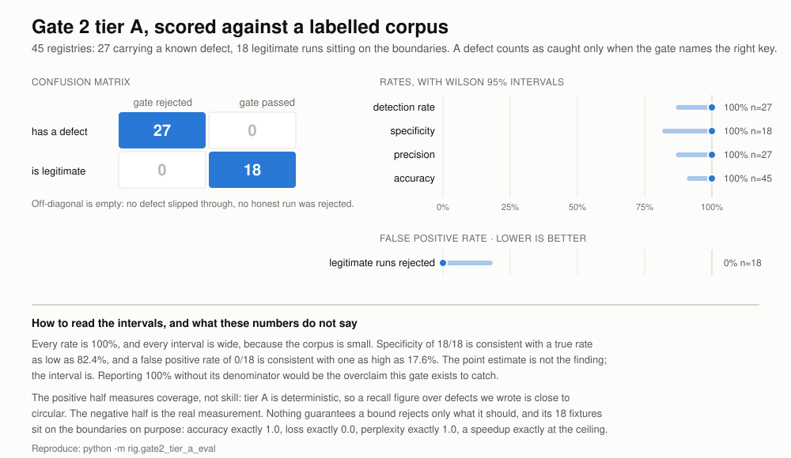

# Gate 2 tier A: what changed, measured

Branch `research/gate2-gate3-readout`. Not merged, not on `main`.

Three commits, each independently green. Every number here was produced by
running code in this repository, and the command that produces it is given.
Nothing in `reports/finalized-report-and-results/` was touched.

---

## Metrics



45 registries, each labelled: 27 carry a known defect, 18 are legitimate runs.
Reproduce with `python -m rig.gate2_tier_a_eval`.

|  | gate rejected | gate passed |
|---|---|---|
| **registry has a defect** | 27 | 0 |
| **registry is legitimate** | 0 | 18 |

| Rate | Value | k/n | Wilson 95% |
|---|---|---|---|
| Detection rate | 100.0% | 27/27 | [87.5%, 100.0%] |
| False positive rate | 0.0% | 0/18 | [0.0%, 17.6%] |
| Specificity | 100.0% | 18/18 | [82.4%, 100.0%] |
| Precision | 100.0% | 27/27 | [87.5%, 100.0%] |
| Accuracy | 100.0% | 45/45 | [92.1%, 100.0%] |
| Check attribution | 100.0% | 27/27 | [87.5%, 100.0%] |

**The intervals are the finding, not the point estimates.** Every rate is 100%
and every interval is wide, because the corpus is small. 18/18 specificity is
consistent with a true rate as low as 82.4%; 0/18 false positives is consistent
with a true rate as high as 17.6%. Quoting 100% without its denominator would be
the overclaim this gate exists to catch.

**The two halves measure different things.** Tier A is deterministic, so a recall
figure over defects we wrote is close to circular: it reports that checks fire on
the inputs they were written for. That half measures *coverage* — whether a
defect class has a check at all, and whether the check names the right key rather
than failing for an unrelated reason.

The negative half is the real measurement. Nothing guarantees a bound rejects
only what it should, and a false rejection costs an engineer a revision for
nothing. Those 18 fixtures sit on the boundaries deliberately: accuracy exactly
1.0, loss exactly 0.0, count exactly 0, perplexity exactly 1.0, percent exactly
100, a wallclock of 1e-9, a speedup of exactly 500.0 at the ceiling, SAGE's
derived 4,700x, a derived 1e9, an unknown unit, a registry with no values at all,
and 50 legal values at once.

### Check attribution

Each defect is labelled with the check that should own it, so a defect caught by
the wrong check scores as a miss.

| Check | Defects it should own | Caught |
|---|---|---|
| `coherence.range_valid` | 21 | 21 |
| `coherence.internal_consistency` | 3 | 3 |
| `coherence.plausibility` | 3 | 3 |

### Cost

200 warm runs per size, including the `gate2_report.json` write each run, so
every figure is an upper bound on the checks themselves.

| Registry size | Median | p95 |
|---|---|---|
| 4 values | 0.122 ms | 0.229 ms |
| 40 values | 0.145 ms | 0.299 ms |
| 400 values | 0.294 ms | 1.071 ms |

Growth is sublinear across two orders of magnitude because the per-run constant
dominates. **Model calls: 0**, and that zero is structural rather than observed —
tier A takes no `ModelFn` and cannot make a call. MLR-Judge needs one LLM call
per rubric dimension per artifact for the comparable judgement.

### A note on the colours

Red and green were the obvious choice for the two states and were rejected. The
palette validator scores that pair at ΔE 4.1 under deuteranopia against a target
of 8, so a red-green colourblind reader could not separate them. The shipped
palette is the validated categorical slots 1 and 7, and every value carries its
denominator as text, so nothing rests on colour alone.

---

## Commit 1: `ad3a416` — non-finite values

`Range.admits` now rejects NaN and infinity before it consults either bound.

The old behaviour was an accident of operator semantics. `value <= high` is the
comparison NaN fails, so a unit with a ceiling rejected it and a unit without one
admitted it. That left nine units exposed: `loss`, `count`, `s`, `sec`, `secs`,
`seconds`, `ms`, `wallclock_s` and `speedup`. `Band.admits` was never affected,
because `low <= value <= high` fails at its first comparison.

`OPS["ratio"]` returns `math.nan` on a zero denominator, and a wallclock of
exactly zero is what `low_open` exists to reject. `_check_internal_consistency`
does guard `math.isnan`, but only for a relation somebody declared, so with none
declared nothing caught it.

Violations now carry a `finite` flag, and `_describe_violation` splits the
feedback by cause. The old line would have read `nan lies outside (0, +inf]`,
which is not an instruction anybody can act on.

Four tests. Suite 395 to 399.

## Commit 2: `c4d7573` — bounded score units

`auc`, `f1`, `precision` and `recall` get `[0, 1]`. `perplexity` gets a floor of 1.

They are units, not metric names. `_range_for` consults `config.ranges` by key
and then `UNIT_RANGES` by unit, and nothing else, so the spec's proposed
`BASELINE_RANGES` keyed on metric names would have been unreachable code.
`UNIT_RANGES` also carries a standing refusal to guess a range from a name,
because a scaffold may legitimately report a negative score it calls `acc`. An
author writing `unit="f1"` is declaring what the number is, which is a
declaration rather than our inference.

`perplexity >= 1` is the entry to lead with: perplexity is `exp(H)` and cross
entropy cannot be negative, so the bound is arithmetic rather than convention.
It is the only range in the table that supports an elimination-by-construction
claim without further argument.

`test_a_metric_name_alone_never_implies_a_range` pins the decision rather than
the behaviour. A value keyed `a.f1` with no unit stays **unchecked** and the
report says so, so anyone later adding name inference fails the suite.

Six tests. Suite 399 to 405.

## Commit 3: `756f7ee` — the provenance-gated ceiling

New check `coherence.plausibility`, severity FAIL, separate from `range_valid`.

Separate because the two answer different questions. A unit's admissible range is
a fact about the numbers. A ceiling is a prior about what results occur. Folding
the prior into `UNIT_RANGES` would weaken the claim `range_valid` supports, so
they get separate ids and the report says which kind of finding it carries.

**The test is provenance, not magnitude.** A speedup that a declared `Relation`
derives is exempt at any size, because the arithmetic is on the record. SAGE
(arXiv 2606.31478) reports a real FVA runtime about 4,700x FBA, so a flat ceiling
rejects published work. That number is in the suite as the case the gate must not
reject. A relation that resolves but does not hold buys no exemption.

`IMPLAUSIBLE_SPEEDUP = 500.0`, overridable through
`Gate2Config.implausible_speedup`. No argument makes 500 the right number, so it
reaches the report as `ceiling` with `ceiling_origin: "declared"` and a reviewer
can move it instead of guessing at it. This is the reason `Band.origin` exists,
applied to a second declared bound.

500 rather than 1000 for one reason. `MAX_LEN = 1000` is the stdout truncation in
Agent Laboratory's `execute_code` that this project diagnosed as the
hallucination mechanism, and it will be printed prominently in the paper. The two
numbers measure unrelated things, a character count and a speedup multiple, but a
second unexplained 1000 in the same system invites a reader to connect them and
costs a sentence denying it.

The check returns `None` when nothing recorded a speedup, so a registry without
one gets no speedup row rather than a green one. Non-finite speedups are left to
`range_valid`, one defect to one check.

Eleven tests. Suite 405 to 415.

### The report an agent gets

```
GATE 2 — SOURCE ↔ RESULT COHERENCE: FAIL   (attempt 1 of 2)

FAILED CHECKS

  [coherence.plausibility]
    1 speedup(s) above the declared ceiling of 500x that no declared
    relation derives, e.g. exp.speedup = 4700x
      exp.speedup = 4700x is above the declared ceiling of 500x, and no
      declared relation derives it

REQUIRED FIXES
  1. A speedup that large has nothing deriving it. Declare the relation that
     computes it from the two recorded times, so the arithmetic is on the
     record rather than asserted: the ceiling does not apply to a value the
     registry derives, at any size. If nothing derives it, the number is a
     measurement or reporting defect, not a result.
```

The remedy is to show the arithmetic, not to report a smaller number.

---

## Two defects found in the work itself

**The first version of commit 3 shipped a finding the agent never saw.** The
report named the failure and withheld the fix. `render_evidence` and `_FIXES` are
keyed lookups on check id in `gates/report.py`, and a missing key returns nothing
without complaint. A rejection that does not say what to fix is a stall, not a
gate.

The fix is both entries plus
`test_every_check_gate2_emits_can_be_rendered_and_has_a_fix`, which builds a
registry that trips every tier, collects the emitted ids, and asserts each
appears in both registries. No such test existed, which is why this was
invisible. The next check added without a renderer now fails the suite.

**One test asserted the wrong thing and was rewritten.** An early version of
`test_a_non_finite_speedup_is_left_to_the_range_check` expected the plausibility
check to emit with zero violations when the only speedup is `inf`. Emitting a
passing speedup check for a registry whose only speedup is garbage reads as "the
speedups here are fine", which is the green-check-that-never-ran failure the
absent-never-green rule exists to prevent. The check now emits nothing, and a
second test proves a usable subject is not dropped alongside an unusable one.

---

## Test inventory

| commit | suite | delta |
|---|---|---|
| `2da4eff` baseline | 395 passed, 1 skipped | — |
| `ad3a416` non-finite | 399 passed, 1 skipped | +4 |
| `c4d7573` score units | 405 passed, 1 skipped | +6 |
| `756f7ee` plausibility | 415 passed, 1 skipped | +11 |

The skip is `test_experiment_child_cannot_read_parent_proc_environment`, which
reports `Linux /proc test` on macOS. Blocker B3 describes a Linux-only failure
mode and this machine never reaches it.

Named suite counts in `progress.md` all match the tree: gate1 92, gate2 65 before
this work, gate3 19, llm_scan 21, llm_layer 14. `tests_total: 405` did not match
and should have read 396 at `2da4eff`, because the extra nine assumed a
`tests/test_progress.py` that is not in the tree.

---

## One test I changed that a reviewer should look at

`test_each_tier_combination_emits_exactly_its_own_checks` asserts exact check
lists per tier combination, and its `CLEAN` fixture records
`exp2.speedup = 13.611`. The new check emits there and passes, so all four
expected lists gain `coherence.plausibility` and the docstring gains the reason.

`AGENT_CONTEXT.md` §7 calls that test the only coverage of absent-never-green
across tier combinations. The change adds an id. It does not weaken an assertion,
and the no-speedup case still proves the check stays absent.

---

## Open, for a person

1. `IMPLAUSIBLE_SPEEDUP = 500.0` is chosen, not derived, and the code says so.
   The only real datapoint in `Sources/` is SAGE's 4,700x, which sits above it
   and passes through the relation. Revisit if a real run trips it without one.
2. Tier B is not started. Its declared side does not exist yet:
   `make_context()` builds a `Gate1Config`, `gated_review()` hands it to
   `run_gate2()`, and that raises
   `AttributeError: 'Gate1Config' object has no attribute 'ranges'`. Gate 2 has
   no working host entry point, which is not recorded as a blocker in
   `progress.md`.
