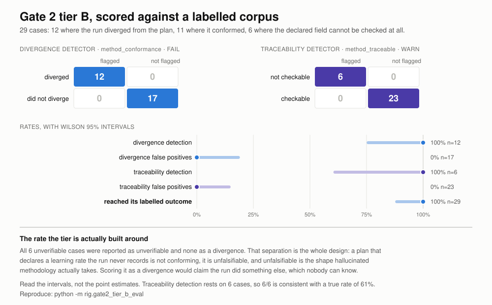

# Gate 2 tier B: methodology conformance, measured

Branch `research/gate2-gate3-readout`. Not merged, not on `main`.

Reproduce with `python -m rig.gate2_tier_b_eval`.

## Why two detectors

Tier B carries two checks with two severities, so it is two detectors and gets
two confusion matrices.

`coherence.method_conformance` (FAIL) must catch a run that used a value the plan
did not declare, and must not fail a run that conformed.
`coherence.method_traceable` (WARN) must flag a declared field nothing can be
checked against, and must not flag one that can.

## The corpus

29 cases: 12 divergent, 11 conforming, 6 unverifiable.

| Detector | | flagged | not flagged |
|---|---|---|---|
| **divergence** | run diverged | 12 | 0 |
| | did not diverge | 0 | 17 |
| **traceability** | field not checkable | 6 | 0 |
| | field checkable | 0 | 23 |

| Rate | Value | k/n | Wilson 95% |
|---|---|---|---|
| Divergence detection | 100.0% | 12/12 | [75.7%, 100.0%] |
| Divergence false positives | 0.0% | 0/17 | [0.0%, 18.4%] |
| Traceability detection | 100.0% | 6/6 | [61.0%, 100.0%] |
| Traceability false positives | 0.0% | 0/23 | [0.0%, 14.3%] |
| Outcomes kept apart | 100.0% | 6/6 | [61.0%, 100.0%] |
| Reached its labelled outcome | 100.0% | 29/29 | [88.3%, 100.0%] |

## The rate the tier is built around

**All 6 unverifiable cases were reported as unverifiable and none as a
divergence.** That separation is the design. A plan that declares a learning rate
the run never records is not conforming; it is unfalsifiable, and unfalsifiable
is the shape hallucinated methodology actually takes. Scoring it as a divergence
would claim the run did something else, which nobody can know.

Every unverifiable case is therefore scored twice: as a negative for the
divergence detector and a positive for the traceability detector.

`literal_that_also_differs` is the case that pins the precedence. The recorded
value both differs from the declaration *and* was typed at the `record_result`
call. It is reported as unverifiable rather than divergent, because a number the
agent typed is not evidence about the run in either direction.

## What the positives do and do not show

The divergent and conforming halves cover comparison semantics: integer against
float, binary representation, scientific notation, string padding, case,
booleans, sign, zero, and a number recorded as the string that spells it. Those
are decisions about what counts as the same value, and the corpus is where they
are written down.

The `unverifiable` half is the one that tests the design rather than the
implementation, because the failure it guards against is a category error rather
than a missed comparison.

## Read the intervals

Traceability detection rests on 6 cases, so 6/6 is consistent with a true rate as
low as 61%. Divergence detection rests on 12, with a lower bound of 75.7%. The
point estimates are all 100% and none of them is the finding.

## Not yet measured

The corpus supplies `plan_fields` directly to `Gate2Config`. Nothing here
exercises a host: `make_review_context()` does not accept `plan_fields` yet, and
no adapter extracts them from Agent Laboratory's plan artifact, which our
interface still sees as free-text `task_ref`. These rates measure the check, not
the installation.
