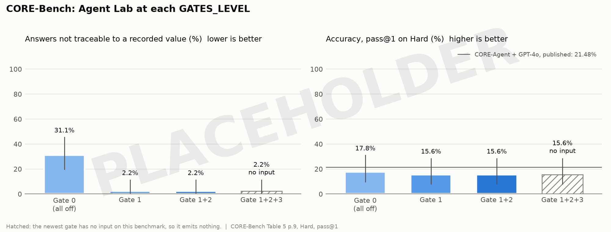
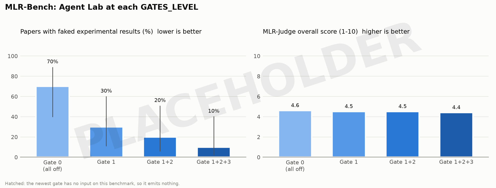
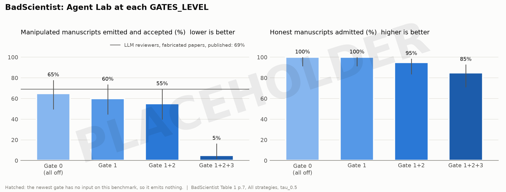
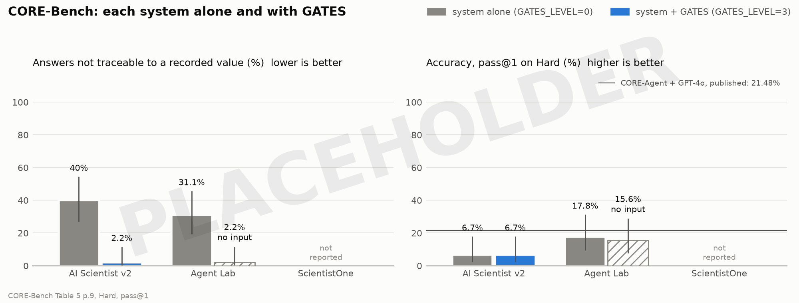
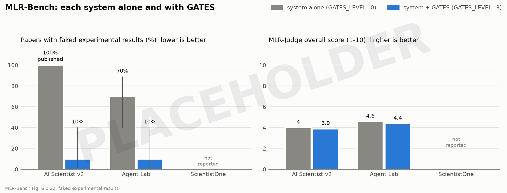
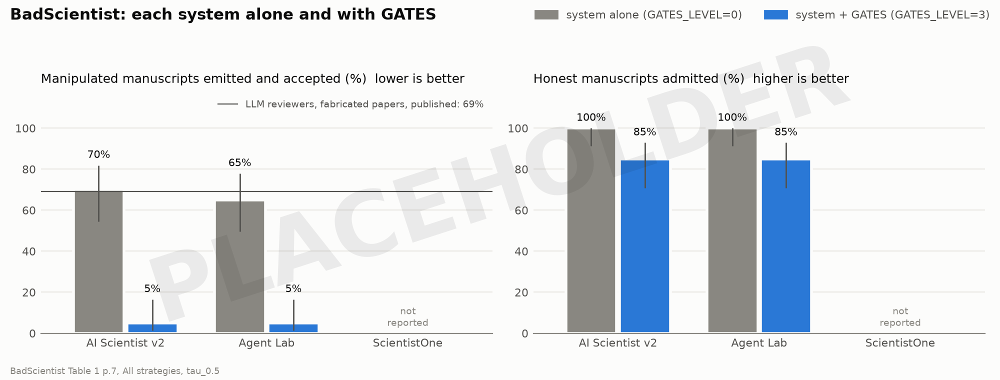
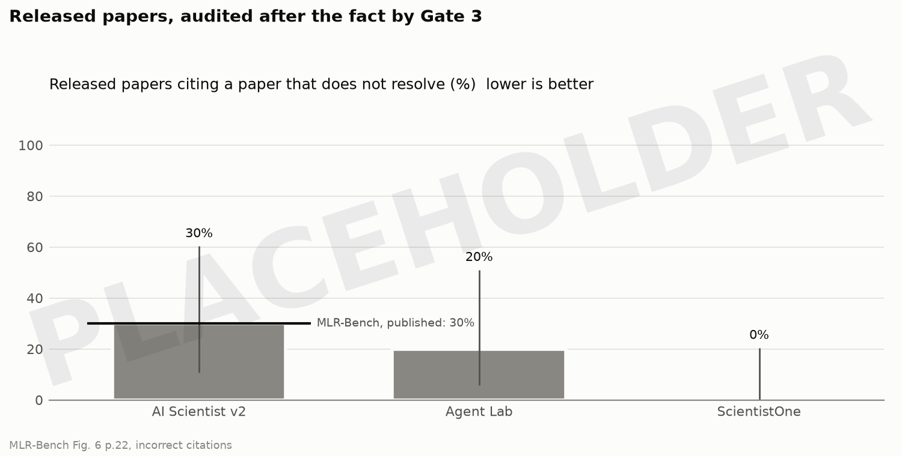

# G.A.T.E.S. evaluation plan

Every figure below is a **dummy**: the expected shape of a run that has not happened, stamped PLACEHOLDER.
Section 5 is how each one becomes real.
The paper's numbers come from `results.csv` and nowhere else, and `figures.py` draws every figure from it.

The four main files:

| File | What it is |
|---|---|
| `paper/PLAN.md` | this plan: the protocol, each figure with the runs that fill it, and the task list |
| `paper/results.csv` | one row per bar, with `status` = `dummy`, `measured`, `published` or `not_reported` |
| `paper/figures.py` | draws every figure from the CSV; `python3 paper/figures.py` |
| `paper/draft/main.tex` | the first draft of the paper, in the AAMAS 2027 template |

## 1. The claim, and what would show it

Hallucinated results in autonomous research agents are an information-flow defect, not a model tendency.
If that is right, three things are true, and each figure tests one of them:

1. Turning the gates on removes fabricated results, one gate at a time, in the order the information flows (figures 1-3).
2. It does so on more than one host, and a host with GATES beats the same host without them (figures 4-6).
3. It does not cost the task: the task score stays level while the integrity metric falls, the "no integrity trade-off" framing ScientistOne uses (right-hand panel of every figure).

## 2. The four levels

One switch, `GATES_LEVEL`, cumulative because each gate reads what the one before it produced (D58 in `progress.md`).

| Level | Label on the figures | Gates open |
|---|---|---|
| `0` | Gate 0 (all off) | none: the host exactly as shipped |
| `1` | Gate 1 | Gate 1; Gates 2 and 3 closed |
| `2` | Gate 1+2 | Gates 1 and 2; Gate 3 closed |
| `3` | Gate 1+2+3 | all three |

A closed gate raises before it spends an agent turn, so no level can run Gate 2 or Gate 3 without the gates below it.

## 3. The three benchmarks, and what each gate sees on each

| | Gate 1 (did it run?) | Gate 2 (plan vs run) | Gate 3 (manuscript) |
|---|---|---|---|
| **CORE-Bench** | each answer must be a value the executed capsule recorded | declared ranges on the answers | **no manuscript: no input** |
| **MLR-Bench** | the experiment run | ranges, relations, and `plan_fields` a model extracts (capped at WARN, D55) | the paper |
| **BadScientist** | the experiment run | as MLR-Bench | the manipulated write-up |

A gate with no input emits nothing (`CLAUDE.md` §2), so its bar repeats the level below it.
The figures draw that bar hatched and labelled "no input" rather than dropping it.

### Metric definitions

| Benchmark | Integrity metric (lower is better) | Task score (higher is better) | Unit of n |
|---|---|---|---|
| CORE-Bench | answers not traceable to a recorded value | pass@1 accuracy on CORE-Bench-Hard | task, 45 in the test split |
| MLR-Bench | papers with faked experimental results, MLR-Bench's own Figure 6 category, labelled by a judge that is not the model under test (D54) | MLR-Judge overall score, 1-10 | task, 10 |
| BadScientist | manipulated manuscripts the system emits **and** a reviewer accepts | honest manuscripts Gate 3 admits | manuscript, 40 |

Every rate carries a Wilson interval and its denominator (`docs/PLAN.md` §8.3).
A published number carries neither, because we did not measure it.

## 4. The figures

### Figure 1: CORE-Bench by level



Expected: untraceable answers collapse at Gate 1, because an answer must be a recorded value, and accuracy dips slightly because some honest-but-unrecorded answers are now rejected.
Gate 3 has no manuscript here, so the last bar is hatched.
Reference line: CORE-Agent with GPT-4o, 21.48% pass@1 on Hard (CORE-Bench Table 5, p.9).

### Figure 2: MLR-Bench by level



Expected: the biggest single drop is at Gate 1, since most faked results in MLR-Bench's audit are numbers no code produced.
Gates 2 and 3 take the remainder: results that ran but contradict the plan, and numbers the writer typed rather than cited.
The MLR-Judge score stays within noise, which is the no-trade-off claim.

### Figure 3: BadScientist by level



Expected: Gates 1 and 2 barely move the attack, because it lives in the write-up, and Gate 3 is what stops it.
This is the one benchmark where Gate 3 carries the result, so it is Gate 3's adversarial evaluation (closes F18).
The right panel is the cost: honest write-ups Gate 3 wrongly rejects.
Reference line: 69.0% acceptance for fabricated papers under the composed "All" strategy at τ0.5 (BadScientist Table 1, p.7).
Their papers had no experiments at all, so the line is context, not a like-for-like baseline.

### Figures 4-6: each system alone and with GATES





Gray is the system as released (level 0); blue is the same system at level 3.
The one published cell today is AI Scientist v2 on MLR-Bench: 100% of its papers had faked experimental results (MLR-Bench Figure 6, p.22).
ScientistOne reports on none of these three benchmarks, so its cells say "not reported" until phase 8 runs it or it publishes.
"Agent Lab + GATES" is the honest label for what the draft PDF called "Gate 1+2+3": GATES is a layer, not a system.

### Figure 7: released papers, audited after the fact



Gate 3's run-independent check, `source.identifiers_resolve`, needs no run and no registry, so it can audit papers other systems already released, the way ScientistOne's CoE Audit did.
The two published numbers disagree: MLR-Bench found incorrect citations in 30% of AI Scientist v2's papers, while ScientistOne's audit found 0 of 159 references hallucinated for the same system on different tasks.
Running one check over all of them is how the paper settles that.

### Key results tiles

The project page opens with four tiles, the way ScientistOne's does, filled from level 3 once measured:

| Tile | Source figure |
|---|---|
| fabricated results emitted, MLR-Bench | figure 2, level 3 |
| manipulated manuscripts emitted, BadScientist | figure 3, level 3 |
| task score change from level 0 to level 3 | figures 1-2, right panels |
| released papers with a citation that does not resolve | figure 7 |

## 5. How to run it

Each phase ends on a done-criterion, and each fills named rows of `results.csv`.

**Phase 0 - done 09-21.**
`GATES_LEVEL` switch and its tests (D58), the shared loops moved to `gates/pipeline.py`, per-gate install skills and the plugin (D59), this plan and its dummy figures (D60).

**Phase 1 - the level runner.**
Generalise the host's `tools_full_gate1_ablation.py` from two arms to the four levels: it sets `GATES_LEVEL` per arm instead of `GATES_GATE1`, and writes the run layout in section 6.
`paper/collect.py` is built (09-26): it reads the run folders, rewrites each cell's two CSV rows as `measured`, and writes each cell's measured cost and wallclock to `paper/costs.csv`.
`tests/test_collect.py` holds the done-criterion on a fake tree: one task at four levels turns eight rows from `dummy` to `measured`.
What remains is the runner in the host.
Done when one real task runs at all four levels and `collect.py` measures its rows.

**Phase 2 - MLR-Bench pilot.**
One task, four levels, one seed, with tasks taken from MLR-Bench's release rather than retyped.
It measures cost and wallclock per run (M6), and those choose the seed count.
Done when the pilot's cost per level is recorded and the seed count is written into this plan.

**Phase 3 - MLR-Bench.**
Ten tasks, four levels, the chosen seeds, paired.
The faked-results labels come from a judge agent that is not the model under test (D54).
Done when figure 2 has no dummy rows.

**Phase 4 - BadScientist.**
Reuse phase 3's runs: the attack lives in the writing phase, so only the writer changes.
For each of the 10 tasks, four manipulated write-ups (s1 TooGoodGains, s2 BaselineSelect, s3 StatTheater, and All) and four honest ones, at every level.
A reviewer that is not the model under test scores each write-up, accepting at BadScientist's τ0.5 threshold.
Done when figure 3 has no dummy rows.

**Phase 5 - CORE-Bench.**
A harness that hands one CodeOcean capsule and its questions to Agent Lab's experiment phase, and requires each answer as `record_result("<question id>", value)`.
Agent Lab is a paper-writing scaffold, not a repository-reproduction agent, so this harness is the largest piece of new work.
Run CORE-Bench-Hard's 45 test tasks at all four levels.
This supersedes D8, which rejected CORE-Bench because only 17 of its 181 questions have stochastic answers: that mattered for Gate 2's tolerance bands, not for Gate 1.
Done when figure 1 has no dummy rows.

**Phase 6 - post-hoc audit.**
`rig/posthoc_audit.py` is built (09-26): it runs Gate 3's `source.identifiers_resolve` with `arxiv_lookup` over every paper under `<root>/<system>/`, through `audit_identifiers`, because `run_gate3` needs a citable registry that a released paper does not have.
Only arXiv identifiers are checkable, so a paper citing none is counted as not checkable, never as clean.
What remains is collecting each system's released papers as text.
Done when figure 7 has no dummy rows.

**Phase 7 - AI Scientist v2 adapter (late stage, after phases 1-6).**
Clone SakanaAI/AI-Scientist-v2 read-only beside `gates/`, confirm where it executes experiment code and parses metrics, and write `gates/adapters/ai_scientist_v2.py` with the `install-gates` skill, as its first real test.
Run it at levels 0 and 3 on the three benchmarks.
Done when the AI Scientist v2 cells in figures 4-6 are measured.

**Phase 8 - further systems (later).**
Run ScientistOne or other systems if their code is released; otherwise their cells stay "not reported".

**Phase 9 - fill the paper.**
Regenerate the figures, confirm none carries PLACEHOLDER, write the results and discussion in `paper/draft/main.tex`, and build the project page: key results tiles and a papers-and-code browser over the run folders.

## 6. Where each run's output goes

One folder per run, outside the repository because runs are large, so a papers-and-code browser can be built straight from it later:

```
runs/<benchmark>/<task>/<system>/L<level>/seed<k>/
  manifest.json        benchmark, task, system, level, seed, model, config SHA-256, both repos' commit SHAs, cost_usd, wallclock_s
  metrics.json         integrity_event and task_score, written once the judge has labelled the run
  paper/               the manuscript the system emitted, or reason.txt saying why none was
  code/                the experiment code that produced the registry
  agent_log.txt
  gate_artifacts/      every gate report, the registry, divergence.jsonl
  judge/               the judge's labels and scores, with the judge's model named
```

## 7. Decisions taken with a default

Each was open; the default is what the plan runs unless changed here.

| Decision | Default | Why |
|---|---|---|
| model under test | `deepseek-flash`, DeepSeek V4.1 Flash (D62) | DeepSeek serves V4.1 Flash under this name since 2026-09-10, and routes the old `deepseek-v4-flash` to it with no end date, so pinning the old name would not reproduce V4 either. The 08-15 Gate 1 evidence was V4 Flash, so level 1 here is compared with it as context, not as a replication |
| second model | `deepseek-v4-pro`, MLR-Bench at levels 0 and 3 (D62) | the thesis says fabrication is an information-flow defect, not a model tendency; the same drop on two models is direct evidence for it (§9) |
| judge and reviewer | Gemini Pro and Claude Sonnet, scores averaged (D62) | MLR-Judge averages Gemini-2.5-Pro-Preview and Claude-3.7-Sonnet, so this stays comparable, and neither is the model under test (D54). Those versions may be retired: each run's `judge/` names the exact model ids, and the paper calls them successors. Needs a Google and an Anthropic key |
| cost | measured per run, never capped (D62) | `manifest.json` records `cost_usd` and `wallclock_s`, and `paper/collect.py` totals them in `costs.csv`; the number is published, so it is measured, not limited |
| seeds | chosen after the phase 2 pilot, by §9's power rule | the pilot's discordance sets the count |
| BadScientist variant | real runs with manipulated write-ups | fabricated papers with no experiments never pass Gate 1, so every level from 1 up would read 0% and measure nothing about Gates 2 and 3 |
| CORE-Bench split | Hard, 45 test tasks | the level where agents fail most, so the most room to see an effect |
| venue | AAMAS 2027 | the template is already in `AI Research/`; confirm before phase 9 |

## 8. Mechanism evidence (paper appendix)

Measured already, and cited from the repository rather than re-run.
These say how the gates behave; the figures above say what they change.

| Gate | Result | Source |
|---|---|---|
| Gate 1 | 40/40 required values delivered downstream, against 0/40 through the host's 1,000-character channel | `README.md`, measured results |
| Gate 1 | 28/29 manuscript claims traceable, against 0/11 ungated | `README.md`, measured results |
| Gate 1 | reviewer score 3.735 gated against 3.765 ungated: the evidence channel, not the science, changed | `README.md`, measured results |
| Gate 2 tier A | 27/27 defects caught, 0/18 clean registries flagged, over 45 labelled registries | `rig/gate2_tier_a_eval.py` |
| Gate 2 tier B | 12/12 and 6/6 caught, 0/17 and 0/23 false alarms, over 29 cases | `rig/gate2_tier_b_eval.py` |
| Gate 3 | 34 of 49 result literals in two archived manuscripts detected, 15 missed, 12 of the misses from one rule | `rig/gate3_scanner_miss.py` (G3-M4, D48) |

The mechanism metrics M1-M6 are defined in `docs/PLAN.md` §8.2.

## 9. Significance, fixed before any run

"GATES significantly improves the host" is tested this way, written down before the pilot so the test cannot be chosen after the results.
The functions are in `rig/stats.py`, stdlib only, so every number can be recomputed on a bare interpreter.

**Integrity, per benchmark.**
Level 0 and level 3 run on the same task with the same seed, so each task-seed is a pair.
The outcome is the benchmark's integrity event from §3: a faked result, an untraceable answer, or a manipulated manuscript accepted.
`b` counts pairs where only level 0 had the event, `c` pairs where only level 3 did.
The test is an exact McNemar test on `b` and `c` (`mcnemar_exact`), two-sided.
The three benchmarks are corrected together with Holm (`holm`) at α = 0.05.
GATES improves a benchmark when its Holm-adjusted p is at most 0.05 and `b > c`.

**Task score, per benchmark.**
The claim is non-inferiority: the gates do not cost the task.
The statistic is the mean of level 3 minus level 0 over the same pairs, with a seeded 95% percentile bootstrap interval over the pairs (`paired_bootstrap_ci`, 10,000 resamples, seed 0).
Non-inferior means the interval's lower bound stays above the negative of a margin fixed now (`non_inferior`):

| Benchmark | Task score | Margin |
|---|---|---|
| MLR-Bench | MLR-Judge overall, 1-10 | 0.5 points |
| CORE-Bench | pass@1 | 5 percentage points |
| BadScientist | honest manuscripts admitted | 10 percentage points |

**Levels 1 and 2** are reported with Wilson intervals (`wilson`) and are not tested.
They show where along the pipeline the effect arrives; testing them too would spend the α on a question the paper does not ask.

**Seeds.**
The pilot measures the discordant shares at level 0 and level 3.
The seed count is the smallest that gives 80% power for that discordance at α = 0.05 (`mcnemar_pairs_needed`), divided by the tasks in the benchmark and rounded up.
The pilot's own runs are not counted in the test.

**Second model.**
`deepseek-v4-pro` runs MLR-Bench at levels 0 and 3 under the same test, reported as its own row and outside the Holm family.
It asks whether the effect belongs to the information flow or to one model, which is the thesis in §1.
